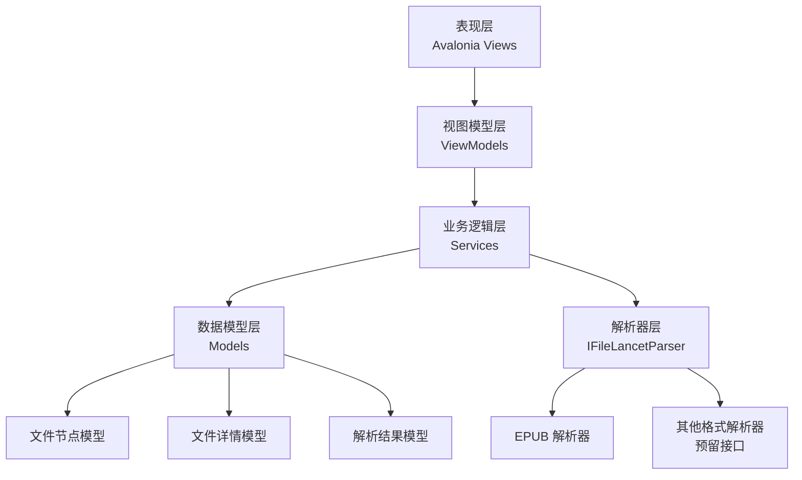
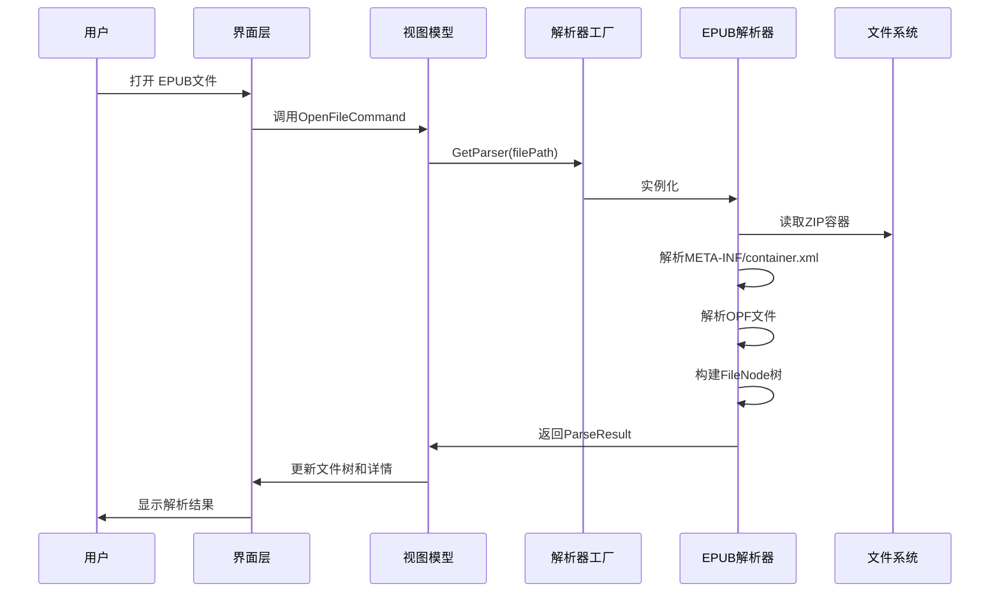
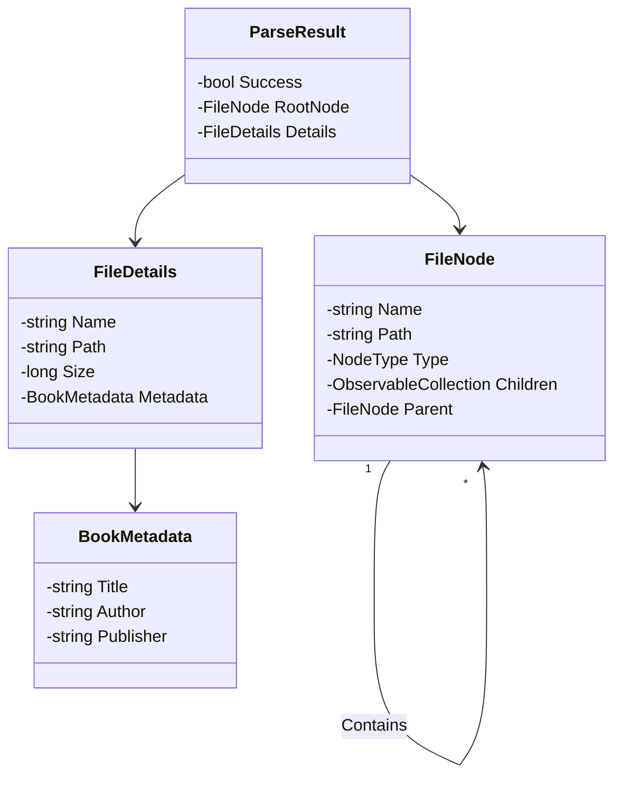

# File Lancet 详细设计文档

## 1. 文档概述

### 1.1 文档目的

本文档是 File Lancet 项目的详细设计规范，基于项目需求说明书和技术路线纲要，旨在为开发团队提供明确的技术实现指导。文档详细描述了系统架构、数据模型、界面设计、核心功能实现细节以及测试和部署计划，确保开发过程的一致性和可追踪性。

### 1.2 术语定义

| 术语 | 解释 |
|------|------|
| EPUB | 电子出版物的标准格式，基于 ZIP 容器和 XHTML 内容 |
| OPF | Open Packaging Format，EPUB 的核心配置文件，包含元数据和资源清单 |
| NCX | Navigation Control file for XML，EPUB 2.0 的导航文件 |
| NAV | Navigation Document，EPUB 3.0 的导航文件 |
| Spine | EPUB 中定义阅读顺序的元素 |
| MIME 类型 | 标识文件类型的标准，如 text/html、image/jpeg 等 |
| MVVM | Model-View-ViewModel 架构模式，用于分离 UI 和业务逻辑 |
| Avalonia | 跨平台 UI 框架，用于构建桌面应用程序 |

## 2. 系统架构设计

### 2.1 架构概览

File Lancet 采用分层架构设计，确保核心解析逻辑与 UI 层完全分离，同时通过插件化策略模式实现高扩展性。



### 2.2 分层职责

| 层次 | 职责 | 主要组件 | 技术实现 |
|------|------|---------|---------|
| 表现层 | 界面展示与用户交互 | MainWindow.axaml | Avalonia UI |
| 视图模型层 | 状态管理与数据绑定 | MainViewModel.cs | CommunityToolkit.Mvvm |
| 业务逻辑层 | 核心解析引擎与服务 | ParserFactory.cs | .NET 8 |
| 解析器层 | 具体文件格式解析 | EpubParser.cs, IFileLancetParser.cs | System.IO.Compression, System.Xml.Linq |
| 数据模型层 | 定义数据结构 | FileNode.cs, FileDetails.cs | C# 类 |

### 2.3 核心流程图

#### 2.3.1 文件解析流程



## 3. 数据模型设计

### 3.1 核心数据结构

#### 3.1.1 NodeType 枚举

| 枚举值 | 说明 | 适用文件类型 |
|--------|------|------------|
| Root | 根节点 | EPUB 文件本身 |
| Folder | 文件夹 | 目录结构 |
| Configuration | 配置文件 | OPF、NCX、container.xml |
| Text | 文本文件 | TXT、MD 等 |
| Html | HTML 文件 | XHTML、HTML |
| Css | CSS 文件 | CSS 样式表 |
| Image | 图片文件 | JPG、PNG、SVG 等 |
| Font | 字体文件 | TTF、OTF、WOFF |
| Audio | 音频文件 | MP3、OGG、WAV |
| Video | 视频文件 | MP4、WebM |
| Binary | 二进制文件 | 其他二进制数据 |
| Unknown | 未知类型 | 无法识别的文件 |

#### 3.1.2 FileNode 类

| 属性 | 类型 | 说明 | 可空 | 初始值 |
|------|------|------|------|--------|
| Name | string | 节点名称 | 否 | string.Empty |
| Path | string | 节点路径 | 否 | string.Empty |
| Type | NodeType | 节点类型 | 否 | NodeType.Unknown |
| Description | string | 节点描述 | 否 | string.Empty |
| Size | long | 文件大小（字节） | 否 | 0 |
| LastModified | DateTime? | 最后修改时间 | 是 | null |
| Children | ObservableCollection<FileNode> | 子节点集合 | 否 | 空集合 |
| Parent | FileNode? | 父节点 | 是 | null |
| IsExpanded | bool | 是否展开 | 否 | false |
| IsSelected | bool | 是否选中 | 否 | false |
| MimeType | string? | MIME 类型 | 是 | null |
| IsLazyLoaded | bool | 是否懒加载 | 否 | false |
| HasChildren | bool | 是否有子节点 | 否 | 计算属性 |
| FullPath | string | 完整路径 | 否 | 计算属性 |

#### 3.1.3 FileDetails 类

| 属性 | 类型 | 说明 | 可空 | 初始值 |
|------|------|------|------|--------|
| Name | string | 文件名称 | 否 | string.Empty |
| Path | string | 文件路径 | 否 | string.Empty |
| Size | long | 文件大小（字节） | 否 | 0 |
| MimeType | string? | MIME 类型 | 是 | null |
| LastModified | DateTime? | 最后修改时间 | 是 | null |
| CompressionRatio | double? | 压缩率 | 是 | null |
| Metadata | BookMetadata? | 书籍元数据 | 是 | null |

#### 3.1.4 BookMetadata 类

| 属性 | 类型 | 说明 | 可空 | 初始值 |
|------|------|------|------|--------|
| Title | string? | 书名 | 是 | null |
| Author | string? | 作者 | 是 | null |
| Publisher | string? | 出版社 | 是 | null |
| Language | string? | 语言 | 是 | null |
| Isbn | string? | ISBN | 是 | null |
| Description | string? | 描述 | 是 | null |
| PublicationDate | DateTime? | 出版日期 | 是 | null |
| EpubVersion | string? | EPUB 版本 | 是 | null |
| Contributors | List<string> | 贡献者 | 否 | 空列表 |
| Subjects | List<string> | 主题 | 否 | 空列表 |

#### 3.1.5 ParseResult 类

| 属性 | 类型 | 说明 | 可空 | 初始值 |
|------|------|------|------|--------|
| Success | bool | 解析是否成功 | 否 | false |
| ErrorMessage | string? | 错误信息 | 是 | null |
| RootNode | FileNode? | 根节点 | 是 | null |
| Details | FileDetails? | 文件详情 | 是 | null |
| ParseTime | TimeSpan | 解析耗时 | 否 | TimeSpan.Zero |

### 3.2 数据模型关系



## 4. 核心功能实现

### 4.1 解析器系统

#### 4.1.1 IFileLancetParser 接口

```csharp
public interface IFileLancetParser
{
    bool CanParse(string filePath);
    Task<ParseResult> ParseAsync(string filePath, CancellationToken cancellationToken = default);
    string[] SupportedExtensions { get; }
    string ParserName { get; }
}
```

#### 4.1.2 ParserFactory 实现

| 方法 | 说明 | 参数 | 返回值 |
|------|------|------|--------|
| GetParser | 根据文件路径获取合适的解析器 | string filePath | IFileLancetParser? |
| GetAllParsers | 获取所有可用的解析器 | 无 | IEnumerable<IFileLancetParser> |

#### 4.1.3 EpubParser 核心实现

| 方法 | 说明 | 实现细节 |
|------|------|----------|
| CanParse | 判断是否支持该文件 | 检查文件扩展名和 META-INF/container.xml 存在 |
| ParseAsync | 解析 EPUB 文件 | 1. 打开 ZIP 容器<br>2. 解析 container.xml 获取 OPF 路径<br>3. 解析 OPF 获取元数据<br>4. 构建 FileNode 树<br>5. 返回解析结果 |
| ParseOpfAsync | 解析 OPF 文件 | 使用 System.Xml.Linq 解析 OPF，提取元数据 |
| BuildFileTreeAsync | 构建文件树 | 遍历 ZIP 条目，构建目录结构和文件节点 |
| GetNodeType | 根据文件名判断节点类型 | 基于文件扩展名映射到 NodeType |
| GetMimeType | 获取文件 MIME 类型 | 基于文件扩展名返回对应的 MIME 类型 |
| GetFileDescription | 获取文件描述 | 根据文件名和类型生成描述文本 |

### 4.2 界面系统

#### 4.2.1 MainViewModel 核心功能

| 属性 | 类型 | 说明 | 绑定目标 |
|------|------|------|----------|
| FileTreeNodes | ObservableCollection<FileNode> | 文件树数据源 | TreeView.ItemsSource |
| SelectedNode | FileNode? | 当前选中节点 | TreeView.SelectedItem |
| NodeDetails | FileDetails? | 节点详情 | 中栏属性面板 |
| StatusMessage | string | 状态信息 | 状态栏 |
| CurrentFilePath | string | 当前文件路径 | 状态栏 |
| IsLoading | bool | 是否正在加载 | 加载指示器 |

| 命令 | 说明 | 实现 |
|------|------|------|
| OpenFileCommand | 打开文件对话框 | 调用 OpenFileDialog 选择文件 |
| LoadFileCommand | 加载文件 | 异步调用解析器解析文件 |

#### 4.2.2 MainWindow 布局

| 区域 | 控件 | 功能 | 绑定 |
|------|------|------|------|
| 菜单栏 | Menu | 文件操作 | OpenFileCommand |
| 左栏 | TreeView | 文件结构树 | FileTreeNodes, SelectedNode |
| 中栏 | StackPanel + Grid | 属性详情 | NodeDetails |
| 右栏 | Border | 内容预览 | 预留 |
| 状态栏 | TextBlock | 状态信息 | StatusMessage, CurrentFilePath |

### 4.3 懒加载机制

| 实现点 | 说明 | 技术方案 |
|--------|------|----------|
| 节点创建 | 仅创建节点结构，不读取内容 | 在 BuildFileTreeAsync 中仅存储 ZIP Entry 引用 |
| 内容读取 | 仅在需要时读取 | 点击节点或请求预览时才读取文件流 |
| 内存管理 | 及时释放资源 | 使用 using 语句和 IDisposable 确保资源释放 |

### 4.4 拖拽功能

| 实现点 | 说明 | 技术方案 |
|--------|------|----------|
| 窗口设置 | 启用拖放 | AllowDrop = true |
| 事件处理 | 处理文件拖放 | 重写 OnDrop 方法，提取文件路径 |
| 解析调用 | 调用解析器 | 调用 LoadFileCommand 解析拖放的文件 |

## 5. 界面设计

### 5.1 布局结构

| 区域 | 大小 | 功能 |
|------|------|------|
| 菜单栏 | 30px | 文件操作、帮助 |
| 左栏 | 250px | 文件结构树 |
| 分隔条1 | 5px | 可拖拽调整宽度 |
| 中栏 | 自适应 | 属性详情面板 |
| 分隔条2 | 5px | 可拖拽调整宽度 |
| 右栏 | 400px | 内容预览 |
| 状态栏 | 25px | 状态信息、文件路径 |

### 5.2 控件设计

| 控件 | 类型 | 用途 | 样式 |
|------|------|------|------|
| 文件树 | TreeView | 显示文件结构 | 自定义 DataTemplate，根据节点类型显示不同图标 |
| 属性面板 | StackPanel + Grid | 显示文件属性 | 分组显示物理属性和元数据 |
| 预览区域 | Border | 预览文件内容 | 占位符，后续集成 WebView |
| 状态栏 | Grid | 显示状态信息 | 左侧显示状态，右侧显示文件路径 |
| 加载指示器 | ProgressBar | 显示加载进度 | 半透明覆盖层 |

### 5.3 交互设计

| 操作 | 触发方式 | 响应 |
|------|----------|------|
| 打开文件 | 菜单/拖拽 | 显示文件选择对话框/直接解析 |
| 展开/折叠 | 点击树节点 | 展开/折叠子节点 |
| 选择节点 | 点击树节点 | 更新中栏属性和状态栏信息 |
| 调整宽度 | 拖拽分隔条 | 调整对应栏的宽度 |
| 预览内容 | 点击文件节点 | 在右栏显示内容预览 |

## 6. 测试计划

### 6.1 单元测试

| 测试项目 | 测试内容 | 测试框架 |
|----------|----------|----------|
| IFileLancetParser | 接口实现验证 | xUnit + Moq |
| EpubParser | EPUB 解析逻辑 | xUnit + FluentAssertions |
| ParserFactory | 解析器工厂功能 | xUnit |
| FileNode | 节点模型功能 | xUnit |
| FileDetails | 详情模型功能 | xUnit |

### 6.2 集成测试

| 测试场景 | 测试内容 | 测试方法 |
|----------|----------|----------|
| EPUB 解析流程 | 完整解析 EPUB 文件 | 使用真实 EPUB 文件测试 |
| 版本兼容性 | 测试不同 EPUB 版本 | 使用 EPUB 2.0、3.0、3.1 文件 |
| 异常处理 | 测试损坏文件处理 | 使用损坏的 EPUB 文件 |
| 大文件处理 | 测试大文件加载 | 使用 >100MB 的 EPUB 文件 |

### 6.3 UI 测试

| 测试项目 | 测试内容 | 测试工具 |
|----------|----------|----------|
| 界面布局 | 三栏布局响应式 | Avalonia UI 测试框架 |
| 文件树交互 | 展开/折叠、选择 | Avalonia UI 测试框架 |
| 拖拽功能 | 文件拖拽打开 | Avalonia UI 测试框架 |
| 状态栏更新 | 状态信息显示 | Avalonia UI 测试框架 |

### 6.4 性能测试

| 测试指标 | 目标值 | 测试工具 |
|----------|--------|----------|
| 大文件加载 | <5 秒 | BenchmarkDotNet |
| 内存占用 | <3 倍文件大小 | 性能分析器 |
| 树节点渲染 | 10000+ 节点流畅 | BenchmarkDotNet |
| 资源释放 | 无内存泄漏 | 性能分析器 |

## 7. 部署计划

### 7.1 构建配置

| 配置 | 目标平台 | 输出类型 |
|------|----------|----------|
| Debug | Any CPU | 可执行文件 |
| Release | Any CPU | 可执行文件 |
| Release | win-x64 | Windows 独立部署 |
| Release | linux-x64 | Linux 独立部署 |

### 7.2 依赖管理

| 依赖 | 版本 | 用途 |
|------|------|------|
| .NET 8.0 | 8.0.0 | 运行时 |
| Avalonia | 11.0.10 | UI 框架 |
| CommunityToolkit.Mvvm | 8.2.2 | MVVM 工具 |
| System.IO.Compression | 4.3.0 | ZIP 处理 |
| xUnit | 2.6.2 | 单元测试 |
| FluentAssertions | 6.12.0 | 测试断言 |
| Moq | 4.20.70 | 测试模拟 |

### 7.3 发布流程

1. **构建**：`dotnet build -c Release`
2. **测试**：`dotnet test`
3. **打包**：
   - Windows：`dotnet publish -c Release -r win-x64 --self-contained`
   - Linux：`dotnet publish -c Release -r linux-x64 --self-contained`
4. **打包安装程序**：
   - Windows：使用 WiX 或 ClickOnce
   - Linux：创建 AppImage 或 DEB 包

## 8. 开发计划

### 8.1 阶段一：核心框架（2周）

| 任务 | 负责人 | 完成标准 |
|------|--------|----------|
| 搭建项目结构 | 开发人员 | 完成解决方案和项目文件 |
| 实现数据模型 | 开发人员 | 完成 FileNode、FileDetails 等模型 |
| 实现解析器接口 | 开发人员 | 完成 IFileLancetParser 接口 |
| 实现 EPUB 解析器 | 开发人员 | 完成 EpubParser 核心逻辑 |
| 编写单元测试 | 开发人员 | 核心功能测试覆盖率 >80% |

### 8.2 阶段二：界面实现（2周）

| 任务 | 负责人 | 完成标准 |
|------|--------|----------|
| 搭建 MVVM 框架 | 开发人员 | 完成 ViewModel 结构 |
| 实现三栏布局 | 开发人员 | 完成 MainWindow 布局 |
| 实现文件树绑定 | 开发人员 | 左栏树状显示正常 |
| 实现属性面板 | 开发人员 | 中栏属性显示正常 |
| 实现状态栏 | 开发人员 | 状态栏信息显示正常 |

### 8.3 阶段三：功能完善（2周）

| 任务 | 负责人 | 完成标准 |
|------|--------|----------|
| 实现拖拽功能 | 开发人员 | 支持文件拖拽打开 |
| 实现文件对话框 | 开发人员 | 支持通过对话框选择文件 |
| 实现加载状态 | 开发人员 | 加载过程显示进度 |
| 实现错误处理 | 开发人员 | 异常情况友好提示 |
| 集成测试 | 开发人员 | 集成测试通过 |

### 8.4 阶段四：优化与发布（1周）

| 任务 | 负责人 | 完成标准 |
|------|--------|----------|
| 性能优化 | 开发人员 | 大文件加载 <5 秒 |
| 跨平台测试 | 开发人员 | Windows/Linux 运行正常 |
| 打包发布 | 开发人员 | 生成安装包 |
| 文档完善 | 开发人员 | 完成用户文档 |
| 发布 v1.0 | 开发团队 | 正式发布 |

## 9. 风险评估

| 风险 | 影响 | 应对措施 |
|------|------|----------|
| 大文件内存占用 | 应用崩溃 | 实现懒加载和内存监控 |
| 跨平台兼容性 | 界面不一致 | 使用 Avalonia 跨平台测试 |
| EPUB 格式变体 | 解析失败 | 增加格式兼容性检测 |
| 预览功能复杂性 | 开发延迟 | 分阶段实现预览功能 |
| 性能瓶颈 | 响应缓慢 | 异步处理和缓存机制 |

## 10. 结论

本详细设计文档基于项目需求和技术规划，提供了 File Lancet 项目的完整技术实现方案。文档涵盖了系统架构、数据模型、界面设计、核心功能实现、测试计划和部署计划等关键方面，为开发团队提供了明确的技术指导。

通过采用分层架构和插件化策略，File Lancet 项目将具备良好的扩展性和可维护性，能够满足 EPUB 文件解析的核心需求，并为未来支持其他文件格式奠定基础。

项目团队应严格按照本设计文档进行开发，确保代码质量和功能完整性，最终交付一个高质量的文件结构分析工具。
